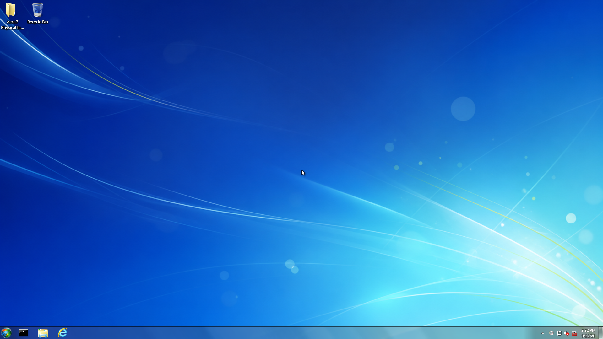

# Aero7 Wiki

  

Welcome to the handbook for **Aero7**, an independent Arch Linux-based operating
system with a Windows-7-era-inspired installer and KDE Plasma 6 Wayland desktop.

Visit the [official Aero7 website](https://aero7.miku-dayo.com/) for project
news, downloads, screenshots, and an overview of the complete system.

> **Beta 2 supports x86-64 UEFI PCs and virtual machines.** The guarded
> installer accepts non-removable SATA, NVMe, MMC, and VirtIO disks. Back up
> important data, disconnect unrelated disks, and verify the selected disk:
> Beta software and partition changes can still cause data loss.

> **Beta 2 was released on 22 September 2026.** GitHub contains the source tag
> and release notes without ISO attachments. Download the recommended offline
> or smaller online installation image only through the official website and
> verify its complete SHA-256 checksum before booting it.

## Start here

| I want to… | Read… |
| --- | --- |
| Download and install Beta 2 | [Installation](Installation.md) |
| Review the Beta 2 release | [Beta 2 Release Notes](Beta-2-Release-Notes.md) |
| Learn the Beta 2 desktop and image choices | [Beta 2 Desktop Guide](Beta-2-Desktop-Guide) |
| Check whether my VM or test PC is supported | [System Requirements](System-Requirements.md) |
| Understand every setup page | [Installer Guide](Installer-Guide.md) |
| Learn what happens after restart | [First Boot and OOBE](First-Boot-and-OOBE.md) |
| See which programs are included | [Included Software](Included-Software.md) |
| Understand optional components | [Aero7 Optional Features](Optional-Features.md) |
| Browse the current interface | [Screenshot Gallery](Screenshot-Gallery.md) |
| Fix a failed or black-screen boot | [Troubleshooting](Troubleshooting.md) |
| Open the recovery console | [Recovery and Logs](Recovery-and-Logs.md) |
| Review Beta limitations | [Known Issues](Known-Issues.md) |

## Technical documentation

- [Architecture](Architecture.md)
- [Security and Disk Safety](Security-and-Disk-Safety.md)
- [Building the ISO](Building-the-ISO.md)
- [Testing and Release](Testing-and-Release.md)
- [Credits and Licensing](Credits-and-Licensing.md)
- [FAQ](FAQ.md)

## Beta 2 installation images

| | |
| --- | --- |
| Recommended offline file | `aero7-beta2-offline-2026.09.22-x86_64.iso` |
| Offline SHA-256 | `f44c52bf8171fd2842e2c6150909e9ca70a577f4e3ac9f6444baeea45f1676a5` |
| Smaller online file | `aero7-beta2-online-2026.09.22-x86_64.iso` |
| Online SHA-256 | `e1744b3be9692af6252bfdc42b83a1bc4c309f33f300771dd3b26cfeacafc936` |
| Firmware | x86-64 UEFI |
| Desktop | KDE Plasma 6 Wayland |
| Intended target | UEFI test PC or disposable QEMU/KVM VM |

Download installation media from the [official website](https://aero7.miku-dayo.com/).
The [GitHub Beta 2 release](https://github.com/aero7-open-project/aero7/releases/tag/v0.2.0-beta.2)
contains source and release notes, not ISO attachments.

## Project links

- [Official Aero7 website](https://aero7.miku-dayo.com/)
- [Aero7 repository](https://github.com/aero7-open-project/aero7)
- [Aero7-shell](https://github.com/memegeko/aero7-shell)
- [Signed Aero7 package repository](https://github.com/memegeko/aero7-repo)
- [Issue tracker](https://github.com/aero7-open-project/aero7/issues)

Aero7 is not affiliated with or endorsed by Microsoft Corporation. It does not
contain a licensed copy of Microsoft Windows.
