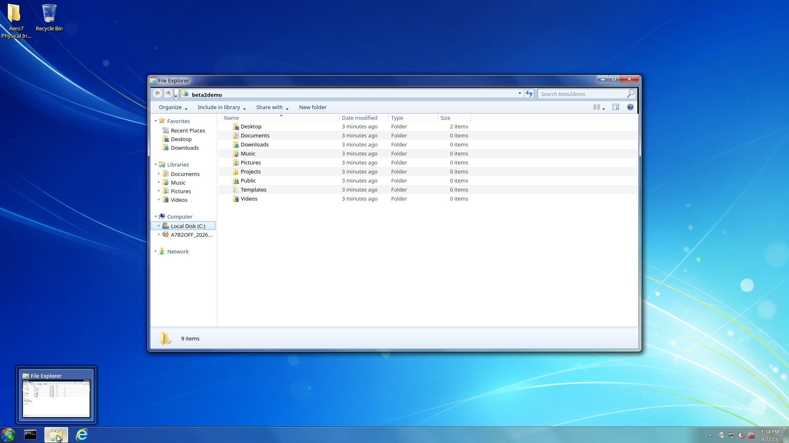
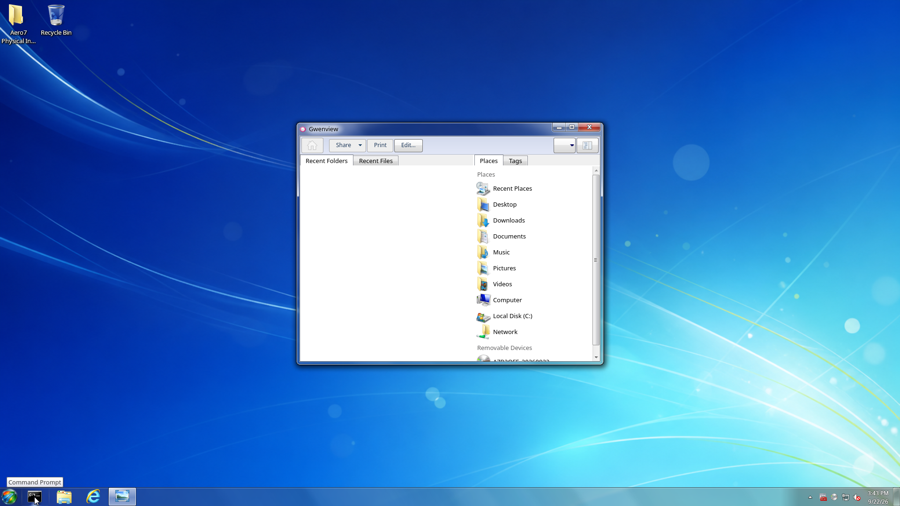
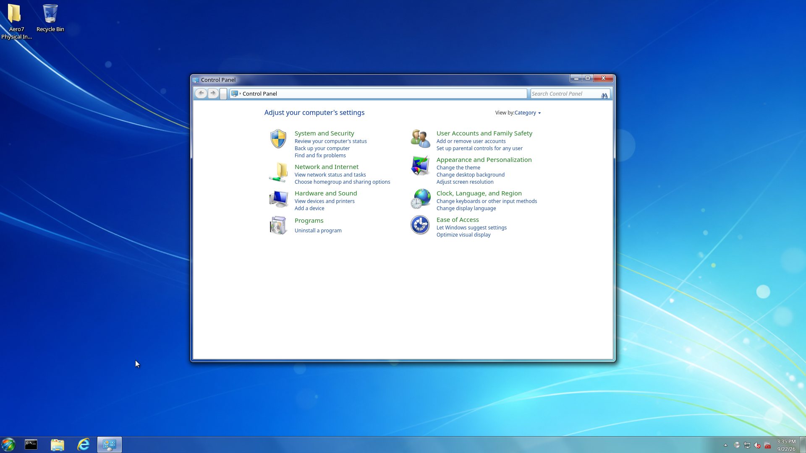
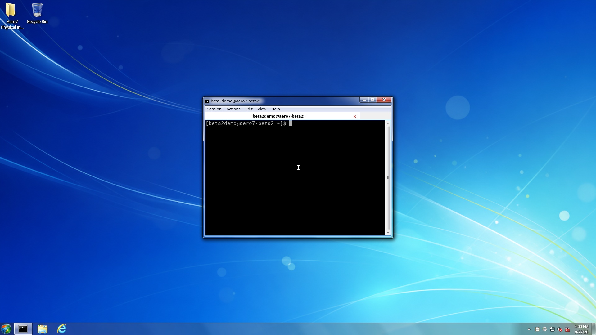
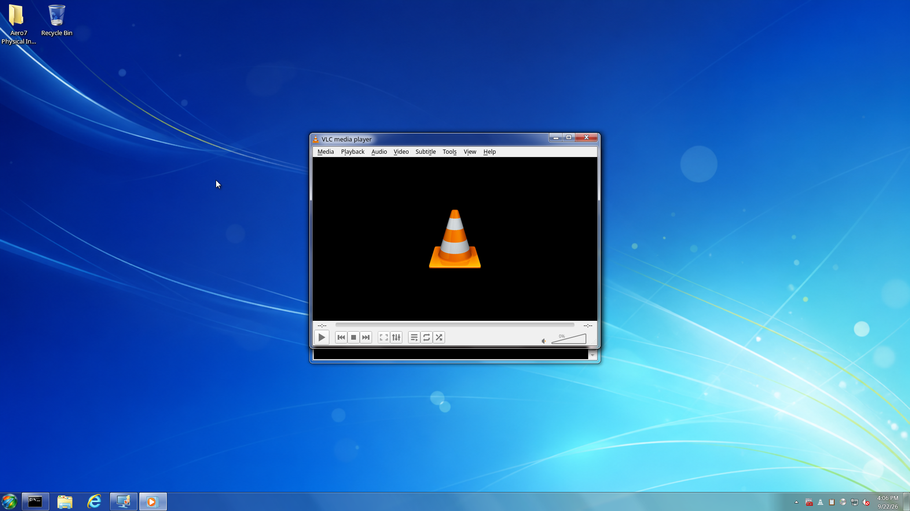
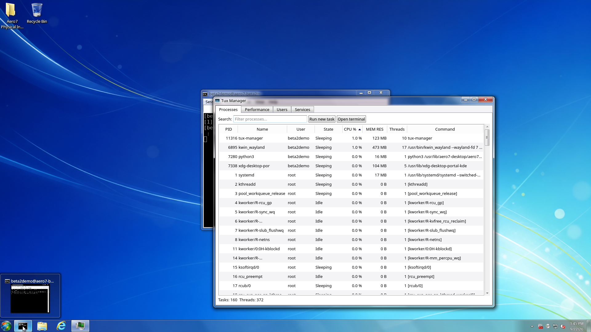

# Included Software

This page describes the Beta 2 package selection, not the unchanged contents
of the public Beta 1 ISO. Beta 2 source/package preparation is separate from
ISO publication. See [Beta 2 Release Notes](Beta-2-Release-Notes).

Aero7 installs a focused desktop foundation rather than the broad
`plasma-meta` or `kde-applications-meta` collections. Runtime dependencies are
resolved normally and the Aero7 packages supply the maintained desktop and
companions. The offline image is recommended when released because it carries
the complete base-install package set.

## Foundation

- Arch Linux base system and Linux kernel;
- KDE Plasma 6 Wayland;
- systemd and systemd-boot;
- NetworkManager;
- PipeWire, PipeWire Pulse, and WirePlumber;
- Mesa graphics stack;
- Qt 6 and Cage;
- SDDM;
- Wine, Wine Mono, and Wine Gecko;
- Plymouth.

## Aero7 desktop packages

- Dedicated `aero7-desktop` Wayland session, Safe Mode, health checks, and recovery;
- AeroShell libplasma, workspace, and KWin components;
- AeroThemePlasma desktop, icon, and sound packages;
- SMOD and the Aero taskbar/Start menu integration;
- UAC-style PolicyKit agent;
- focused light color and wallpaper defaults;
- Aero7 first-login repair and management commands.

## Applications

| Displayed name | Package / role |
| --- | --- |
| File Explorer | `aero7-file-explorer`, the maintained KDE Dolphin fork |
| Photo Viewer | Aero Gwenview |
| Control Panel | `linux-control-panel`, Aero7's maintained settings frontend |
| Device Manager | `aero7-device-manager`, the renamed hardware-management package |
| Computer Management | Aero7 administration companion: services, logs, users/groups, tasks, shares, and storage |
| Paint | Aero KolourPaint |
| Gadgets | `aero7-gadgets`, native host/gallery with nine built-ins |
| Internet Explorer | Aero7 compatibility launcher backed by a maintained installed browser, not Microsoft's retired engine |
| Task Manager | TuxManager |
| Command Prompt | QTerminal with Aero7 launcher branding |
| Media Player | VLC using the Aero7 Qt desktop theme |
| Snipping Tool | Meta+Shift+S rectangle selection; PNG saving, image clipboard data, and an openable notification without the editor |
| Calculator | KCalc |
| Notepad | FeatherPad using the Aero7 Qt desktop theme |
| Archive support | Ark |
| Network connection settings | Plasma Network Management (`plasma-nm`) |
| Firewall | UFW with Aero7 Control Panel management |
| Spelling | Sonnet/Hunspell with English and Dutch dictionaries |
| Account management | AccountsService and authenticated Linux account tools |
| Power status and profiles | UPower and power-profiles-daemon |
| Version information | LinVer |
| Windows executable helper | execbin |

Programs Center Beta is not installed by default. Open **Turn Aero7 features
on or off** to add it from the checksum-verified package retained on the system;
this specific optional feature remains installable without internet access.
See [Aero7 Optional Features](Optional-Features.md) for every available toggle.

## Intentionally absent

- WinXplorer is optional and is not installed by the ISO;
- Sevulet is excluded until source and redistribution terms can be audited;
- Kate and Okular are not part of the focused default application set;
- Konsole is replaced by the lighter QTerminal package;
- CMake, Ninja, `base-devel`, and other source-build tools are not installed on
  the finished binary-package system;
- Plasma Discover and the broad KDE Applications set are not pulled through a
  meta-package.

Every requested signed Aero7 package is queried again after installation. A
copy of the exact request is stored at:

```text
/var/lib/aero7/requested-aero7-packages.txt
```

## Historical Beta 1 application captures

These older images are retained for reference, not presented as the Beta 2
desktop. The [new 1920×1080 VM tour](Screenshot-Gallery) identifies its exact
test-package versions and remaining visual differences.

| File Explorer | Photo Viewer |
| --- | --- |
|  |  |

| Control Panel | Command Prompt |
| --- | --- |
|  |  |

| Media Player | Task Manager |
| --- | --- |
|  |  |

See the [Screenshot Gallery](Screenshot-Gallery.md) for the remaining desktop,
application, system-menu, lock-screen, and authentication captures.
