# Aero7 Screenshot Gallery — 1920×1080

These are real QEMU/KVM VM captures taken on **5 September 2026**, at native
**1920×1080**, **100% scale**, with a single virtual display. They are not
mockups, upscaled images, or retouched composites. Click an image to inspect
the original PNG. See [Capture Details](Screenshot-Capture-Details) for exact
packages, preparation, checksums, and visible limitations.

This is an **updated existing test installation**, not a fresh installation
from either final Beta 2 ISO. The photos/captures do not close the ISO release
gate or certify hardware. Older images remain in
[Historical Beta 1 Screenshots](Historical-Screenshots).

## Desktop and Start

The arranged desktop shows Recycle Bin and the Start, Command Prompt, File
Explorer, and browser taskbar order. Native gadgets were stopped for this
view; see the capture details rather than treating it as a fresh-account test.

[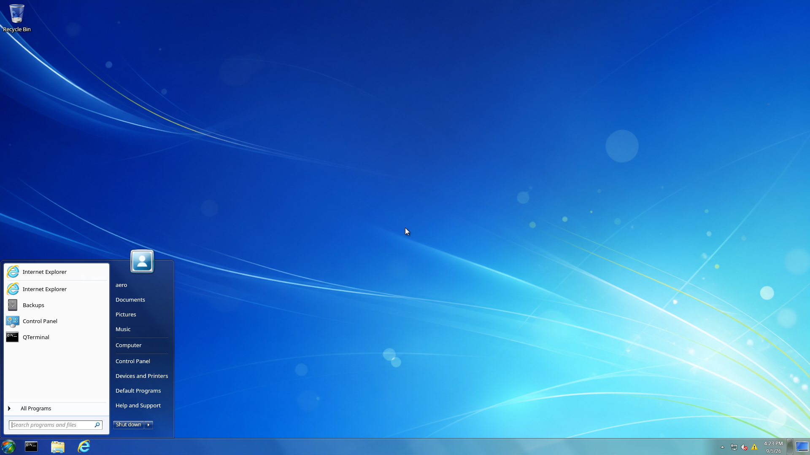](images/beta2-1080p/start-menu.png)

Start exposes search and familiar places. This retained test profile visibly
has duplicate Internet Explorer entries and QTerminal wording. Those are
recorded differences, not claimed to be the final factory Start layout.

## Control Panel

[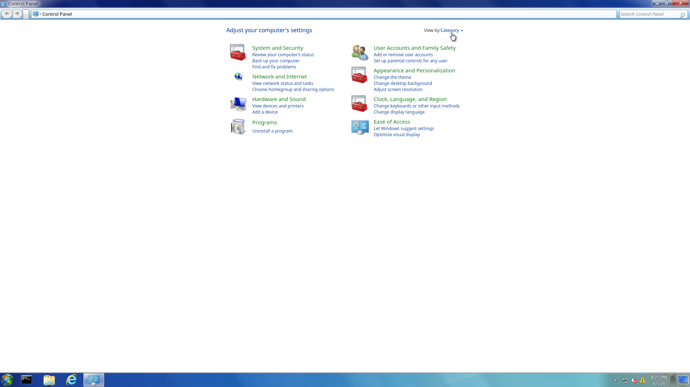](images/beta2-1080p/control-panel-home.png)

Category view groups common settings. Read the
[Control Panel guide](https://github.com/aero7-open-project/aero7-control-panel-/wiki/Control-Panel-Guide)
for the behavior of each route.

[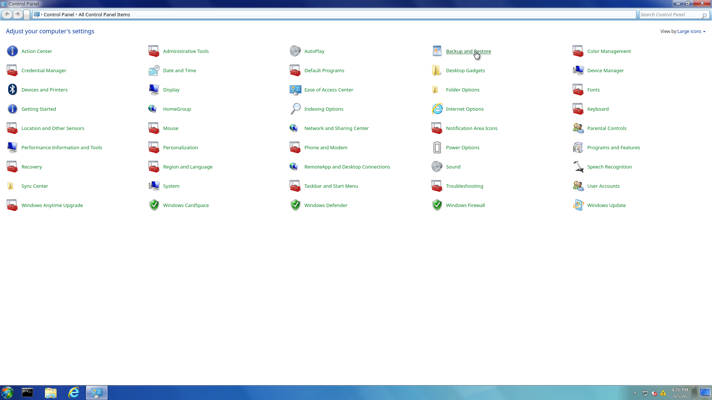](images/beta2-1080p/control-panel-all-items.png)

The 45 public applet names are arranged in five columns. The screenshot
records the installed icon mappings, including repeated generic icons; it is
not a claim of pixel-perfect Windows icon parity. The
[applet matrix](https://github.com/aero7-open-project/aero7-control-panel-/wiki/Applet-Reference)
explains real Linux equivalents and unavailable features.

[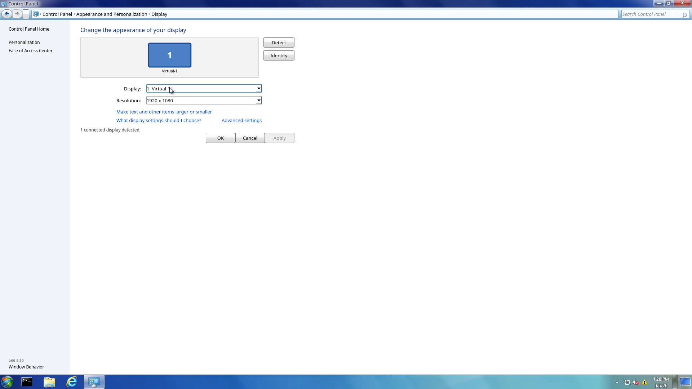](images/beta2-1080p/screen-resolution.png)

The mode shown is the VM's actual KScreen mode at scale 1, not an image resized
after capture. This single-output view does not verify physical hotplug or
mirroring.

[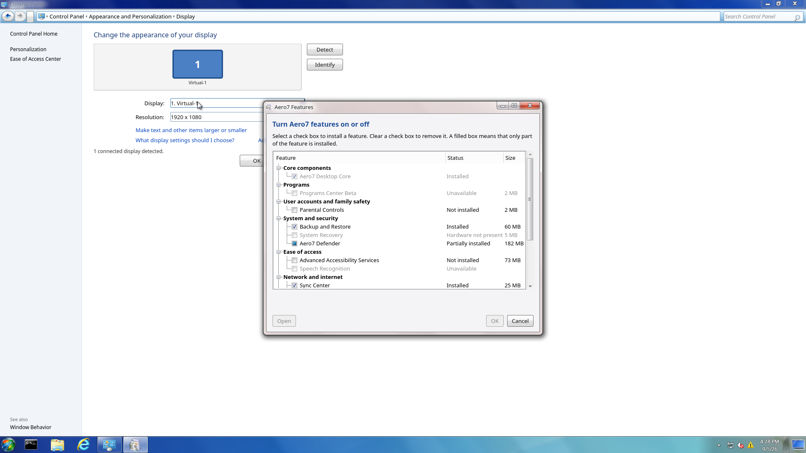](images/beta2-1080p/optional-features.png)

The feature manager shows installed, partial, hardware-dependent, and
unavailable states. This older VM lacks the verified Programs Center cache,
so Programs Center Beta is shown as unavailable. This screenshot does **not**
demonstrate a successful offline enable/remove transaction.

## File Explorer

[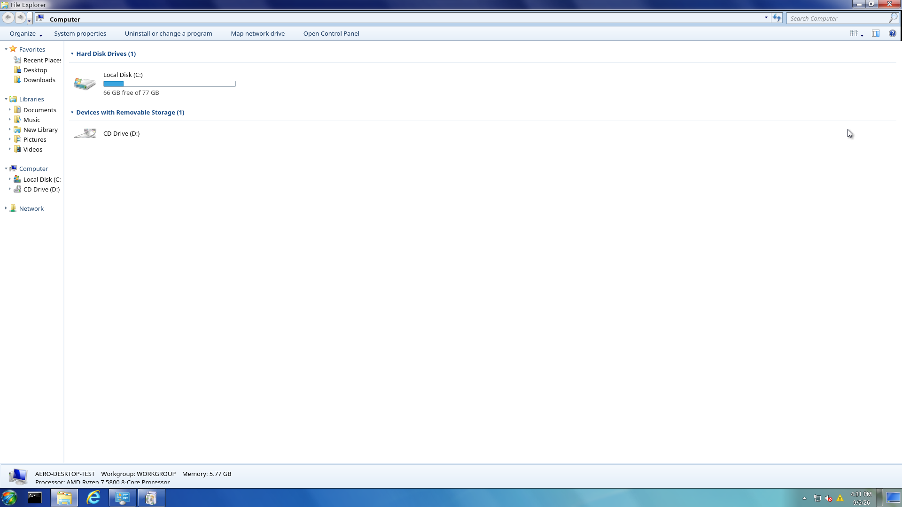](images/beta2-1080p/explorer-computer.png)

Computer uses live capacity/free-space information and filters implementation
mounts. The captured build still clips part of the lower hardware-summary
line; this remains a visual issue, not a polished final-result claim.

[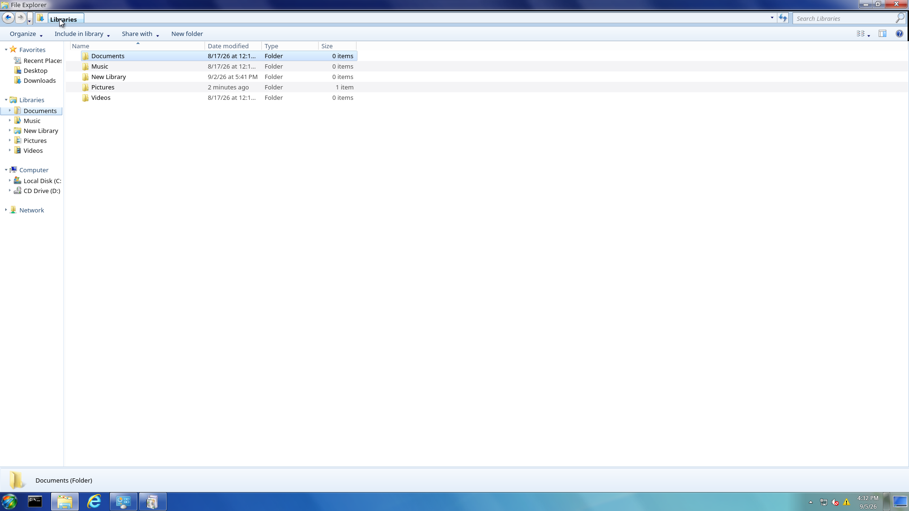](images/beta2-1080p/explorer-libraries.png)

Libraries are shown in Details view. **New Library** was already in this
profile and is not an extra factory Library. The standard definitions are
Documents, Music, Pictures, and Videos.

[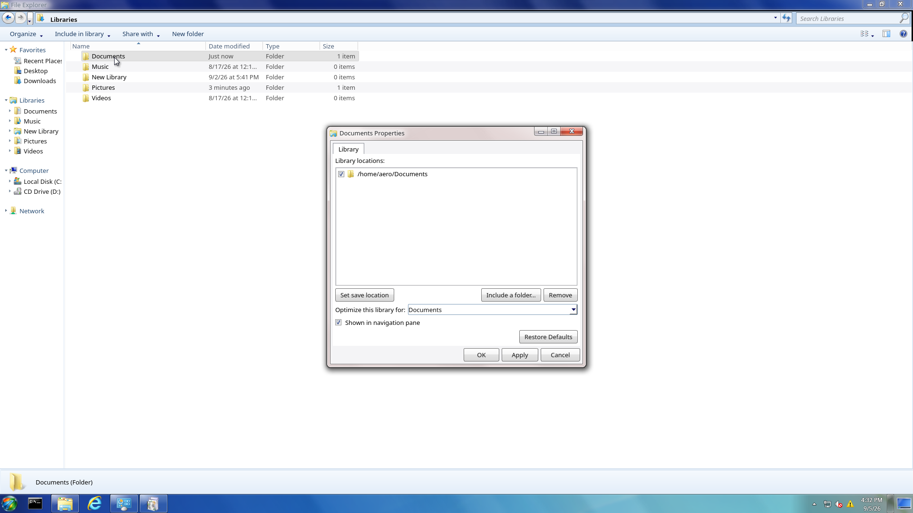](images/beta2-1080p/library-properties.png)

Library Properties exposes the included real folder, save location,
optimization type, navigation visibility, defaults, and Apply/Cancel controls.
See the [Explorer everyday guide](https://github.com/aero7-open-project/aero7-file-explorer/wiki/Everyday-Tasks)
before changing or deleting Library contents.

## Gadgets

[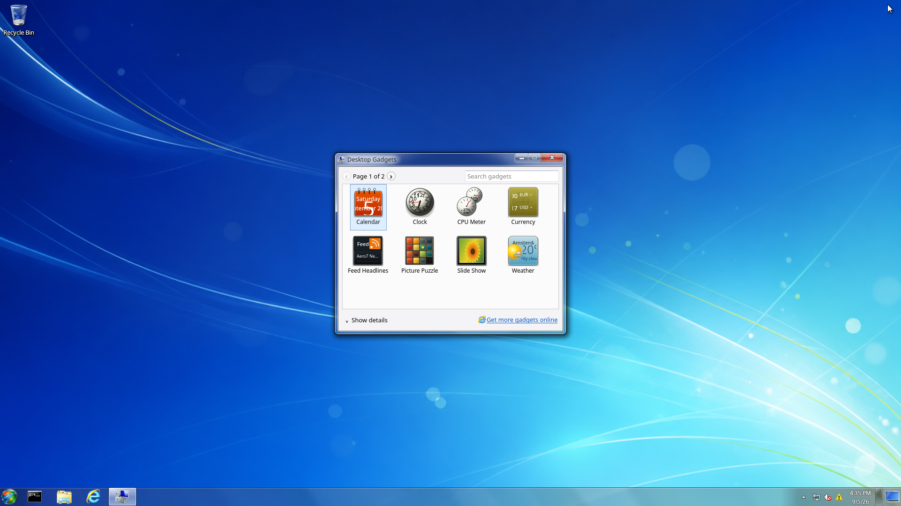](images/beta2-1080p/gadget-gallery.png)

The native gallery's first page contains eight built-ins; Media Center is on
the second page. This older package has text clipping in some thumbnail
artwork. The gallery thumbnails are not live weather or financial evidence.
Read the [nine-gadget guide](https://github.com/aero7-open-project/aero7-desktop/wiki/Desktop-Gadgets)
for real data sources, settings, network needs, and limitations.

## Locking and login

[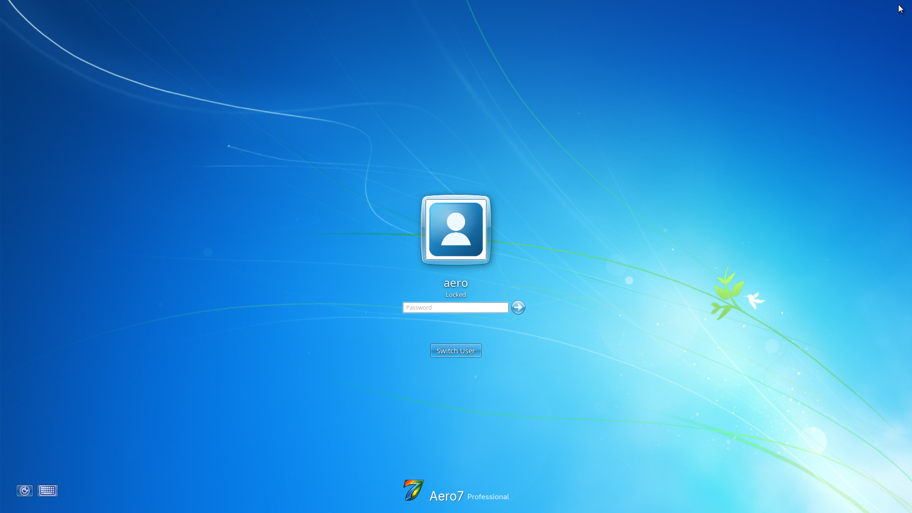](images/beta2-1080p/lock-screen.png)

This capture shows the complete logo at 1080p and an existing locked session.
Unlocking resumes that session; it does not change desktop environments.

[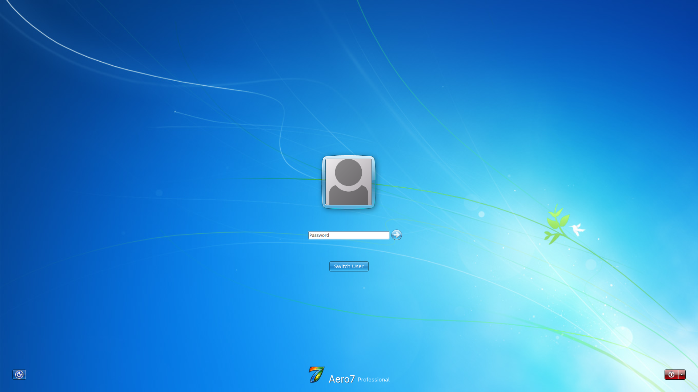](images/beta2-1080p/login-screen.png)

The installed Aero7 SDDM theme was selected explicitly in this test VM. Its
logo is fully visible. The saved account's greeter display-name area is blank
in this capture and still needs investigation; it is not edited out.

The lower-left menu shows Aero7, Safe Mode, AeroThemePlasma, and Plasma sessions
plus the on-screen keyboard. It is not the full Windows pre-login Ease of
Access checkbox sheet.

This view documents the available keyboard UI; it does not certify every
layout, assistive technology, or authentication failure path.
