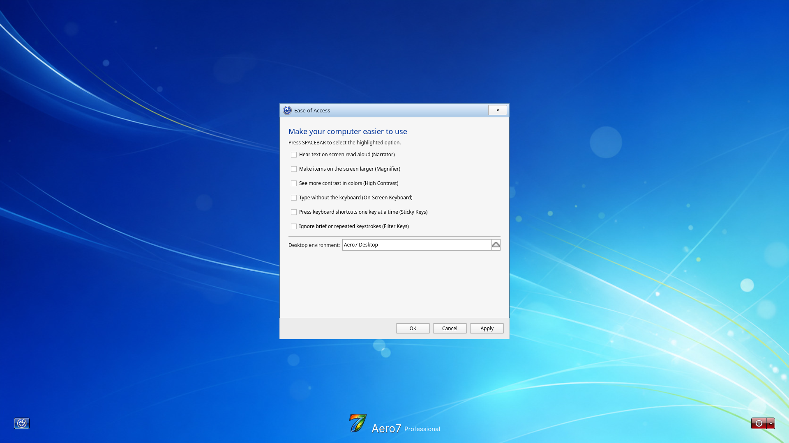
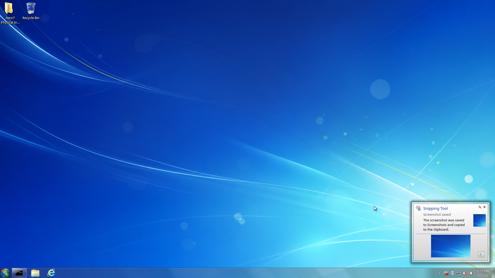

# Aero7 Beta 2 Screenshot Gallery — 1920×1080

These are unedited QEMU/KVM framebuffer captures from a **fresh installation
of the final Aero7 Beta 2 Offline ISO on 22 September 2026**. Every image is an
original 1920×1080 PNG captured at 100% scale. The Online ISO uses the same
desktop packages; its separate clean-install acceptance is recorded in the
Beta 2 QA evidence.

See [Capture Details](Screenshot-Capture-Details) for the exact ISO checksum,
package versions, VM profile and reuse rules. Click any image for the original
PNG.

## Desktop and Start

The fresh account starts with the factory taskbar order and only the Recycle
Bin plus the physical-install diagnostic folder on the desktop.

The Start menu exposes search, Libraries, Computer, Control Panel and the
installed application list without desktop edit mode.

## Control Panel and features

The full 45-item Windows-style applet layout is shown using the packaged Aero7
icons and routes to Linux-backed settings.

The displayed mode is the guest's actual KScreen mode, not a resized image.

Programs Center Beta and Encrypted Credential Vault are optional and off by
default. Installed, unavailable and hardware-dependent states are reported by
the real feature backend.

## File Explorer

Explorer uses the Aero7 name and icon, provides Windows-style Libraries and
Computer views, shows friendly drive labels, and filters implementation-only
mounts. Library Properties identifies the real Linux folder that backs the
Library; it does not pretend the filesystem is NTFS.

## Desktop Gadgets

The first gallery page contains Calendar, Clock, CPU Meter, Currency, Feed
Headlines, Picture Puzzle, Slide Show and Weather. The gallery uses packaged
assets and does not depend on a host icon theme.

## Lock, login and accessibility

Both views show the complete Aero7 Professional branding at 1920×1080.

The lower-left Ease of Access control provides Narrator, Magnifier, High
Contrast, On-Screen Keyboard, Sticky Keys and Filter Keys toggles. Its desktop
selector includes Aero7 Desktop, Safe Mode and the Plasma fallback sessions.

## Screenshot workflow

`Meta+Shift+S` starts rectangular selection. Releasing the pointer closes the
overlay, saves a PNG under `Pictures/Screenshots`, copies the image to the
clipboard and shows the clickable saved notification without opening the
Spectacle editor window.

## Scope

These images verify the visible final-ISO surfaces in this VM. They do not
claim pixel-perfect Windows identity, physical GPU compatibility, every scale
factor, multi-monitor hardware acceptance or universal Windows application
compatibility. Read [Testing and Release](Testing-and-Release) and
[Known Issues](Known-Issues) before publishing release claims.
